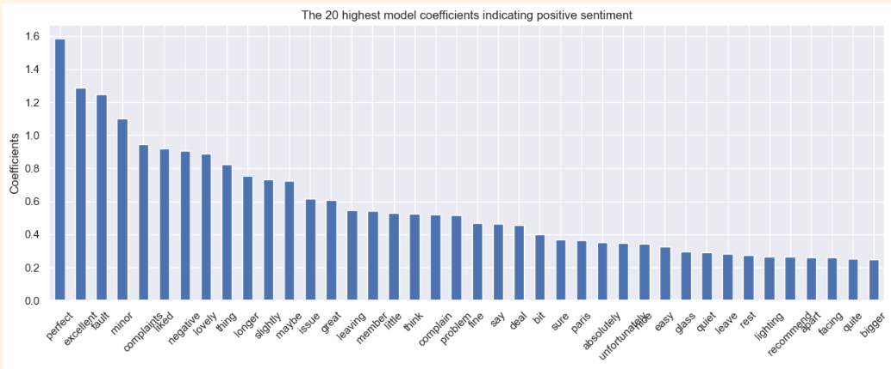
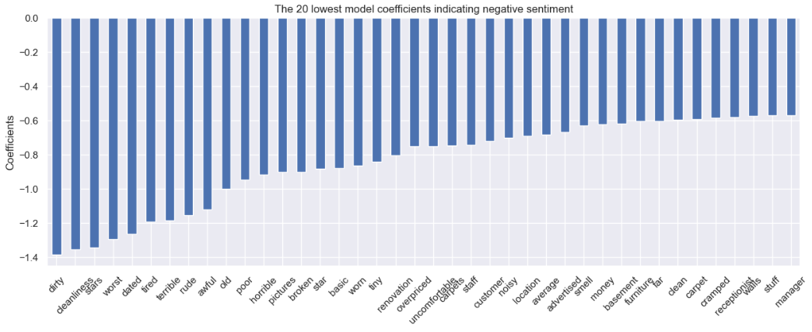

# hotel-review-sentiment-lab

Author: **Hyunjung (Anna) Kim**  
Date: August 13, 2023  

This project presents a complete Natural Language Processing (NLP) workflow for analyzing hotel reviews.  
It focuses on transforming raw, unstructured text data into meaningful signals that can help understand customer sentiment, highlight service issues, and support decision-making in hospitality management.

Using the notebook `Hyunjung_kim_NLP.ipynb`, the project walks through the full lifecycle of a typical NLP pipeline—from data cleaning and exploratory text analysis to vectorization and modeling. The goal is to demonstrate how fundamental NLP techniques can be used to extract insights from large collections of reviews and build simple baseline models for sentiment or topic understanding.

---

## Project Overview

This project aims to analyze hotel review text using classical NLP techniques.  
Given a dataset of customer-written hotel reviews, the workflow begins by converting raw text into clean, consistent, and machine-readable inputs. The notebook implements foundational preprocessing steps such as lowercasing, punctuation stripping, stopword removal, tokenization, and lemmatization to reduce noise and normalize linguistic inconsistencies.

Once the text is cleaned, exploratory data analysis (EDA) is performed to uncover structural patterns in the corpus. The project examines review length distributions, the most frequent tokens, and other word-level statistics to better understand how customers express satisfaction and dissatisfaction. These analyses help reveal common themes—such as complaints about cleanliness or praise for location—that frequently appear in hotel feedback.

Following EDA, the notebook introduces technical feature extraction methods, including Bag-of-Words and TF–IDF vectorization, to transform text into numerical representations suitable for machine learning. Depending on the scope, simple classifiers such as Logistic Regression or Naive Bayes can be trained to predict customer sentiment or categorize reviews by theme. This serves as a baseline NLP model and can be extended to more advanced approaches like word embeddings or deep learning if desired.

Overall, this project demonstrates a practical and structured approach to understanding customer opinions using NLP. It showcases how textual data can be systematically processed and modeled, forming a foundation for more sophisticated analysis such as topic modeling, clustering, or sentiment classification.

---

## Project Structure
- **`Hyunjung_kim_NLP.ipynb`** — Fully-annotated Jupyter notebook containing all preprocessing, EDA, and model-building steps.
- **`README.md`** — Documentation and technical summary of the project.

---

## 1. Data Cleaning & Preprocessing

The notebook includes detailed text-processing steps essential for NLP workflows:

- Lowercasing  
- Removal of punctuation, numerics, and special symbols  
- Stopword removal  
- Tokenization  
- Lemmatization  
- Whitespace normalization  
- Optional filtering of rare/frequent tokens  
- Construction of reusable preprocessing functions  

---

## 2. Exploratory Data Analysis (EDA)

- Review length distribution  
- Frequency analysis (unigrams, bigrams)  
- Visualization of common tokens  
- Identification of commonly negative/positive terms  
- Optional word cloud  
- Inspection of sentiment polarity (if included)  

---

## 3. Modeling (If applicable)

### Feature Engineering
- Bag‑of‑Words  
- TF–IDF  
- Document‑Term Matrix  
- N‑grams  

### Models
- Logistic Regression  
- Naive Bayes  
- Linear SVM  
- Baseline sentiment classifier  
- Topic modeling (LDA)  

### Evaluation
- Train/test split  
- Confusion matrix  
- Accuracy, Precision, Recall, F1  

---

## ▶ How to Run

1. Install dependencies:
```bash
pip install -r requirements.txt
```

2. Open the notebook:
```bash
jupyter notebook Hyunjung_kim_NLP.ipynb
```


# NLP With Hotel Review — Model Coefficient Interpretation

Below are the visualizations and interpretations of the **top positive** and **top negative** model coefficients from the sentiment classifier.  
These coefficients come from a linear model (e.g., Logistic Regression), where **higher positive weights indicate stronger association with positive sentiment**, and **lower negative weights indicate association with negative sentiment**.

---

# Top Positive Sentiment Indicators



## Interpretation

The model assigns the highest positive weights to words that strongly convey satisfaction or a pleasant experience.  
Key observed patterns:

- **Highly positive adjectives** such as *perfect*, *excellent*, *great*, *lovely* signal strong approval.
- **Mildly positive modifiers** like *slightly*, *maybe*, *minor* appear because they often soften complaints (“only a minor issue”), paradoxically correlating with an overall positive review.
- **Service‑related words** such as *member*, *deal*, *fine*, *easy* appear because reviewers use them in positive narratives like “staff was fine,” “check‑in was easy.”
- **Context‑dependent words** (*negative*, *issue*) show slight positive coefficients because they appear in positive contrast structures:
  - “Nothing negative to say”
  - “No major issue”

Overall, these words indicate reviews describing **comfort, satisfaction, and positive experiences**, even when mentioning small issues.

---

# Top Negative Sentiment Indicators



## Interpretation

The negative coefficients emphasize clear dissatisfaction and problematic aspects of hotel experiences.  
Notable trends include:

- **Strong negative descriptors** such as *dirty*, *worst*, *terrible*, *awful*, *horrible* strongly correlate with 1‑star experiences.
- **Maintenance and condition issues**:
  - *dated*, *old*, *broken*, *worn*, *tired*  
    → Indicate aging facilities and lack of upkeep.
- **Comfort and safety complaints**:
  - *tiny*, *basic*, *noisy*, *uncomfortable*, *smelly*  
- **Service-related issues**:
  - *staff*, *manager*, *receptionist*, *customer* often appear in complaints about poor behavior or service quality.
- **Overpriced/poor value terms**:
  - *overpriced*, *money*, *advertised*  
    → Suggest mismatch between expectations and reality.

Negative sentiment words overwhelmingly focus on **cleanliness**, **staff interaction**, **facility condition**, and **value for money**—common pain points in hospitality reviews.


